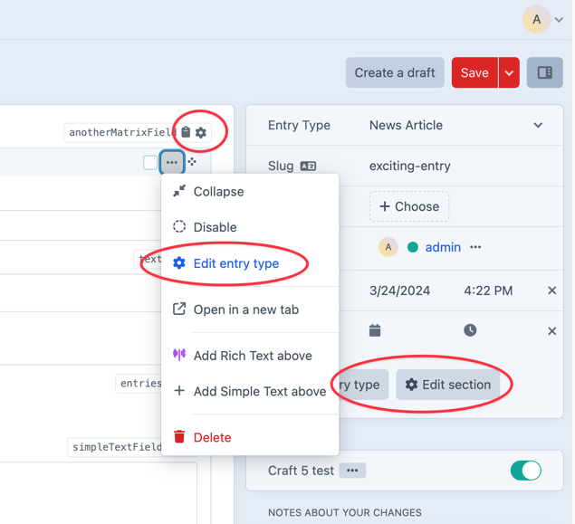

# CP Field Inspect plugin for Craft CMS

[](https://scrutinizer-ci.com/g/mmikkel/CpFieldInspect-Craft/?branch=master)

CP Field Inspect is a tiny utility plugin, that makes content modelling a little bit easier in Craft.    

The plugin adds two things to the Craft control panel (hence the first part of the name!):  

1. **A link for quickly accessing field settings** to the field handles in element edit forms (for admin users who opt to display those). This link appears as a little cogwheel inside the field handle, and clicking this link redirects you to the fields' settings pages, and back to your content when you save the settings.

2. **Links for quickly accessing element source settings** (i.e. entry type, section, volume, category group etc.) to element edit forms, cards, chips and inline Matrix entries (nee _blocks_)

  

## The caveats!  

CP Field Inspect will only add field settings links and element source buttons to the Craft control panel if    

* The logged-in user is an **admin**   
* [`allowAdminChanges`](https://craftcms.com/docs/3.x/config/config-settings.html#allowadminchanges) is `true`  

**If either of the above are false, CP Field Inspect will do absolutely nothing.**  

Additionally, the field settings cogwheels requires the "Show field handles in edit forms" admin user preference.  

## Requirements

**This plugin requires Craft CMS 5.0+.**

## But, the plugin doesn't appear to do *anything*!  

If CP Field Inspect's links won't appear in environments where `allowAdminChanges` is enabled and the user is an admin, the reason is most likely due to the site having one or several plugins or [custom modules](https://docs.craftcms.com/v3/extend/module-guide.html) installed, that call `Craft::$app->getUser()->getIdentity()` or related methods from within their constructor or `init()` methods. This has been confirmed, due to [a bug in Craft](https://github.com/craftcms/cms/issues/2473), to prevent CP Field Inspect from displaying the cogwheels, since `Craft::$app->getUser()->getIsAdmin()` will actually return a false negative in plugins, in this scenario.  

The workaround is to defer any calls to `Craft::$app->getUser()` (such as `Craft::$app->getUser()->getIdentity()` etc.) in the offending custom module to after Craft has finished initialising (the below would go in your custom module's primary class):  

```php
public function init()
{
    parent::init();
    
    Craft::$app->onInit(function () {
        $this->doIt();
    }
    
}

protected function doIt()
{
    $currentUser = Craft::$app->getUser()->getIdentity();
    // ... all other logic dependant on `$currentUser`
}
```

## Disclaimer

Please report any bugs or other issues [here](https://github.com/mmikkel/CpFieldInspect-Craft/issues).  

Plugin icon: CUSTOMIZE SEARCH by creative outlet from [the Noun Project](https://thenounproject.com)  
