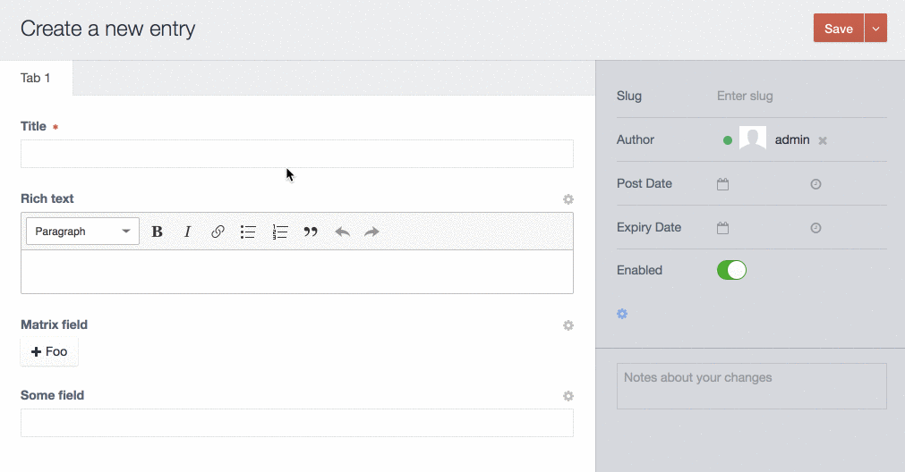

# CP Field Inspect plugin for Craft CMS 3.4.x

[](https://scrutinizer-ci.com/g/mmikkel/CpFieldInspect-Craft/?branch=master)

CP Field Inspect is a tiny utility plugin making content modelling a little bit easier in Craft.  

Did you forget a field handle? Mouse over the cogwheel next to the field title, and CP Field Inspect will tell you.  

Need to adjust some field settings? Click the cogwheel; CP Field Inspect will redirect you to the relevant field's settings page – and back to the content when you're done.  

Additionally, CP Field Inspect will add a link in your element edit forms to manage source settings (e.g. entry type, category group) in the same manner.  

Note that CP Field Inspect will only be active for **admin** users.  



Plugin icon: CUSTOMIZE SEARCH by creative outlet from [the Noun Project](https://thenounproject.com)

## Requirements

**This plugin requires [Craft CMS 3.4.2](https://github.com/craftcms/cms/blob/develop/CHANGELOG-v3.md#342---2020-01-31) or later.**

Older Craft 3.x installs should install CP Field Inspect v. 1.0.7:

    composer require mmikkel/cp-field-inspect:1.0.7  

Looking for the Craft 2 version? [It's right here](https://github.com/mmikkel/CpFieldLinks-Craft).

## Installation

To install the plugin, follow these instructions.

1. Open your terminal and go to your Craft project:

        cd /path/to/project

2. Then tell Composer to load the plugin:

        composer require mmikkel/cp-field-inspect

3. In the Control Panel, go to Settings → Plugins and click the “Install” button for CP Field Inspect.

## Cogwheels not appearing?

A semi-common issue with CP Field Inspect is that the field cogwheels do not appear, even if the currently logged in user has admin privileges. 

This is most often due to the site having one or several [custom modules](https://docs.craftcms.com/v3/extend/module-guide.html) installed, that call `Craft::$app->getUser()->getIdentity()` or similar (i.e. to check the currently logged-in user's group affiliations or permissions) from their constructor or `init()` methods. This has been confirmed, due to [a bug in Craft](https://github.com/craftcms/cms/issues/2473), to prevent CP Field Inspect from displaying the cogwheels, since `Craft::$app->getUser()->getIsAdmin()` will actually return a false negative in plugins, in this scenario.  

The workaround is to defer any calls to `Craft::$app->getUser()` (such as `Craft::$app->getUser()->getIdentity()` etc) in the offending custom module to the `Plugins::AFTER_LOAD_PLUGINS` event; essentially letting plugins like CP Field Inspect load before calling that method (in Craft 3, modules are loaded before plugins).  

Here's how the workaround can look (the below would go in your custom module's primary class):

```php
public function init()
{
    parent::init();
    self::$instance = $this;

    // Defer further boot-up until after plugins have loaded
    Event::on(
        Plugins::class,
        Plugins::EVENT_AFTER_LOAD_PLUGINS,
        function () {
            $this->doIt();
        }
    );

    Craft::info(
        Craft::t(
            'my-module',
            '{name} module loaded',
            ['name' => 'My Module']
        ),
        __METHOD__
    );
}

protected function doIt()
{
    $currentUser = Craft::$app->getUser()->getIdentity();
    // ... all other logic dependant on `$currentUser`
}
```

## Disclaimer

This plugin is provided free of charge and you can do whatever you want with it. CP Field Inspect is _very_ unlikely to mess up your stuff, but just to be clear: the author is not responsible for data loss or any other problems resulting from the use of this plugin.

Please report any bugs, feature requests or other issues [here](https://github.com/mmikkel/CpFieldInspect-Craft/issues). Note that this is a hobby project and no promises are made regarding response time, feature implementations or bug fixes.

**Pull requests are extremely welcome**


